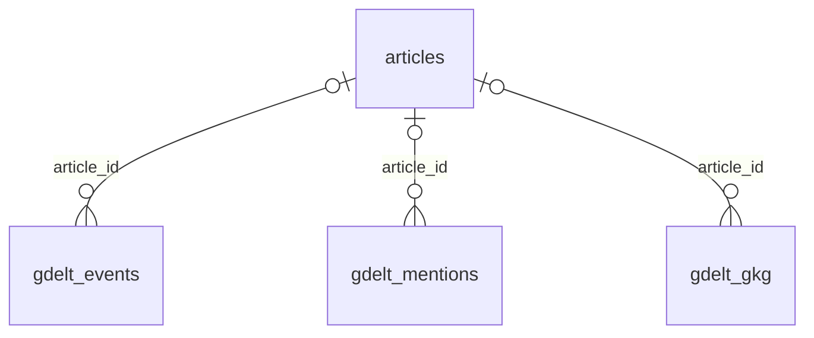
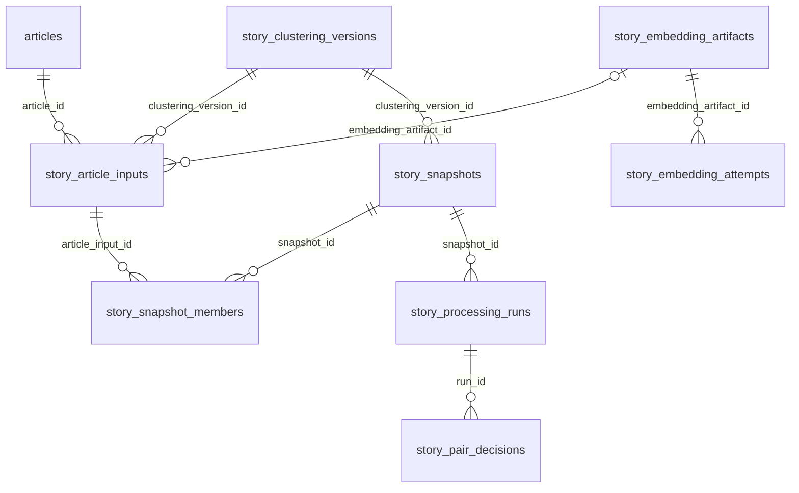
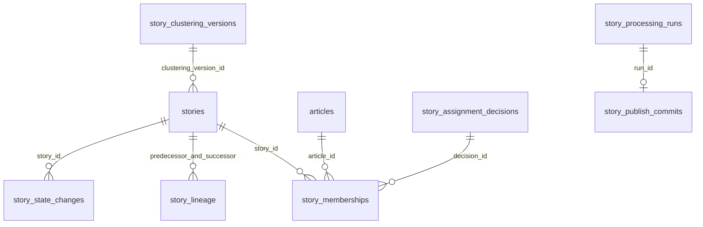
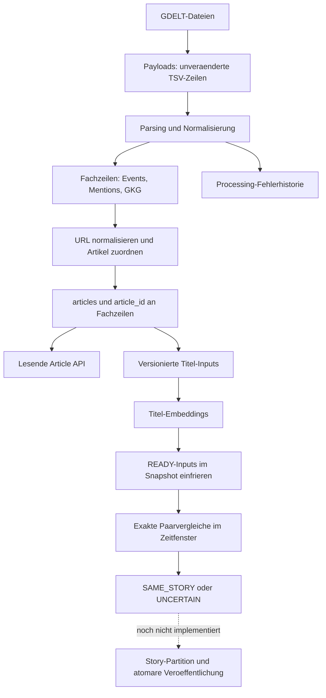

# Datenbank verstehen und durchsuchen

Drei Perspektiven auf dieselbe PostgreSQL-Datenbank: Beziehungen zeigen die Struktur,
Datenansichten erschliessen konkrete Datensaetze, der Datenfluss erklaert ihre Entstehung.
Die Darstellung basiert auf den Migrationen im Repository, nicht auf einer Live-Inventur.

## 1. Tabellen und Beziehungen

Die Diagramme zeigen ausgewaehlte Fremdschluessel. `||` bedeutet genau eine, `o|` null oder
eine, `o{` null bis viele Zeilen. Zusammengesetzte Versions- und Hash-Schluessel sowie
Auditbeziehungen sind zur Lesbarkeit ausgelassen.

### GDELT und Artikel



Ein Artikel wird durch seine normalisierte URL identifiziert; `url_hash` ist eindeutig.
Viele GDELT-Fachzeilen koennen denselben Artikel beschreiben. Eine noch nicht zugeordnete
Fachzeile hat keine `article_id`. Signal-IDs sind nur zusammen mit dem Datensatztyp eindeutig.

Die temporaeren Tabellen `gdelt_event_payloads`, `gdelt_mention_payloads` und
`gdelt_gkg_payloads` enthalten `raw_tsv`. Payload und zugehoerige Fachzeile teilen dieselbe
ID; diese Herkunftsbeziehung ist kein dauerhafter Fremdschluessel, da Payloads nach der
Retention entfernt werden duerfen. Importstatus steht in `gdelt_import_files`, Parsingfehler
in `gdelt_processing_errors`, Zuordnungsfehler in `article_extraction_errors`.

### Story-Vorbereitung



Ein Artikel kann historische Inputs und Inputs fuer verschiedene Clustering-Versionen haben.
`current_marker = 1` kennzeichnet den aktuellen Input je Artikel und Version. Mehrere Inputs
koennen dasselbe Titel-Embedding verwenden. Snapshots halten die konkreten Inputs und
Embedding-Hashes fest; Paarentscheidungen beziehen sich auf diesen eingefrorenen Zustand.

### Veroeffentlichung: Schema vorhanden, Writer noch nicht implementiert



Die Lineage-Tabelle referenziert sowohl die alte als auch die neue Story. Historische
Mitgliedschaften bleiben erhalten. Ein `SAME_STORY`-Paar ist noch keine veroeffentlichte
Story-Zuordnung. Details und alle Tabellen stehen im [Story-Datenmodell](story-data-model.md).

## 2. Gespeicherte Daten durchsuchen

Lokale Compose-Verbindung: PostgreSQL auf `localhost:5432`, Datenbank `gne`, Benutzer und
Passwort jeweils `gne`. In einer SQL-Konsole lassen sich die folgenden Abfragen als
Ergebnisraster anzeigen und nach IDs weiterverfolgen. Alternativ:

```powershell
docker compose exec postgres psql -U gne -d gne
```

Die Abfragen lesen ausschliesslich Daten. `4711` jeweils durch eine Artikel-ID aus der ersten
Abfrage ersetzen. Die Beispiele sind gegen die Schemaquellen geprueft, nicht live ausgefuehrt.

### Artikel finden und seine Signale ansehen

```sql
SELECT id, domain, canonical_url, first_seen_at
FROM articles
ORDER BY first_seen_at DESC, id DESC
LIMIT 50;

SELECT article_id, signal_count, event_signal_count, mention_signal_count, gkg_signal_count
FROM article_signal_summary_view
WHERE article_id = 4711;

SELECT signal_type, source_id, source_timestamp, global_event_id, event_code, themes
FROM article_detail_view
WHERE article_id = 4711
ORDER BY source_timestamp, signal_type, source_id
LIMIT 100;
```

`article_signal_summary_view` liefert eine Zusammenfassung je Artikel;
`article_detail_view` liefert eine Zeile je Signal, bei Artikeln ohne Signale eine Zeile
mit leeren Signalfeldern. Fuer GKG-Details kann die gefundene `source_id` direkt in
`gdelt_gkg.id` nachgeschlagen werden.

### Titel und Embedding-Zustand eines Artikels

```sql
SELECT v.version_key, i.id AS input_id, i.normalized_title,
       i.effective_at, i.effective_at_source, i.title_usability,
       i.embedding_status, i.embedding_artifact_id
FROM story_article_inputs i
JOIN story_clustering_versions v ON v.id = i.clustering_version_id
WHERE i.article_id = 4711 AND i.current_marker = 1
ORDER BY v.version_key;
```

### Vergleichbare Artikel aus dem letzten erfolgreichen Lauf

Die Titel kommen aus den referenzierten historischen Inputs, damit sie zur gespeicherten
Entscheidung passen. Bei einem leeren letzten Lauf bleibt das Ergebnis leer.

```sql
SELECT p.snapshot_id, l.article_id AS left_article_id, l.normalized_title AS left_title,
       r.article_id AS right_article_id, r.normalized_title AS right_title,
       p.cosine_similarity, p.time_distance_seconds, p.result
FROM story_pair_decisions p
JOIN story_article_inputs l ON l.id = p.left_article_input_id
JOIN story_article_inputs r ON r.id = p.right_article_input_id
WHERE p.run_id = (
    SELECT id FROM story_processing_runs
    WHERE status = 'SUCCEEDED'
    ORDER BY completed_at DESC, id DESC LIMIT 1
)
ORDER BY p.cosine_similarity DESC, p.id
LIMIT 50;
```

### Rueckstand der Import-Pipeline

```sql
SELECT dataset_type, payload_rows, pending_payload_rows, open_processing_errors, domain_rows
FROM gdelt_pipeline_health_view
ORDER BY dataset_type;
```

Weitere Abfragen fuer Fehlerhistorie, Embeddings und Runs stehen unter
[Operations](operations.md). Die Beispiele begrenzen die angezeigten Zeilen; Sortierungen
und Views koennen trotzdem groessere Datenmengen lesen.

## 3. Datenfluss von GDELT bis Stories

Diese Pfeile bedeuten Verarbeitung, nicht Fremdschluessel.



Ohne verwendbaren Titel oder erfolgreiches Embedding erreicht ein Input die Paarbewertung
nicht. Ohne API-Schluessel bleiben verwendbare Embedding-Artefakte `PENDING`. Der aktuelle
Snapshot-Job arbeitet ausschliesslich im `SHADOW`-Modus. Erfolgreich verarbeitete Payloads
duerfen nach Ablauf der Retention verschwinden; Fachzeilen und Fehlerhistorie bleiben erhalten.

Quellen: [SQL-Migrationen](../src/main/resources/db/migration),
[Java-Migrationen](../src/main/java/db/migration),
[Story-Verarbeitung](../src/main/java/com/example/globalnewsenginev1/stories).
